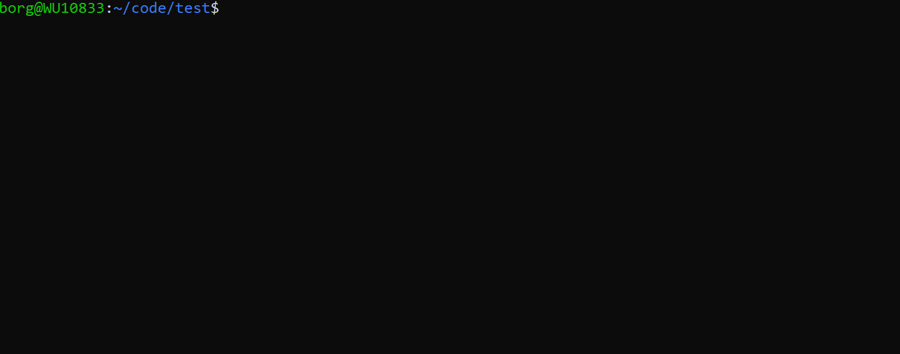

# Appmancer


Appmancer is a command-line interface (CLI) tool designed to enhance the developer's workflow by providing code refactoring suggestions and generating bash commands. It integrates with an AI backend, harnessing the power of machine learning models to analyze and process code efficiently.
## Features
* Bash Command Synthesis: Input a description of the task you want to perform in bash, and Appmancer will generate the corresponding command.
* Refactoring Guidance: Supply the path to a source code file and receive intelligent refactoring tips. Note that content content is written as terminal output.

## Installation
Ensure you have Rust and Cargo installed on your machine to get started with Appmancer.
Follow these steps to install Appmancer:
```
git clone https://github.com/borgstad/appmancer.git
cd appmancer
cargo build --release
```
The built executable will be located at target/release/.

## Usage
Execute Appmancer using the following commands:
```
./appmancer sh "describe your bash task"

./appmancer refactor "path/to/your/source_code_file"
```

Configuration

Appmancer requires the following environment variables:

* OPENAI_API_KEY: Your personal OpenAI API key.
* OPENAI_DEFAULT_MODEL: The preferred OpenAI model (defaults to "gpt-3.5-turbo" if not specified).

You can set these directly in your environment or through a .env file in the project's root directory.
